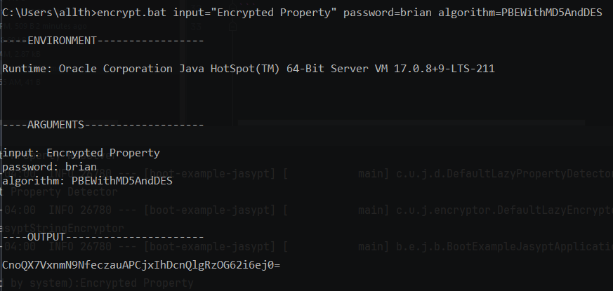
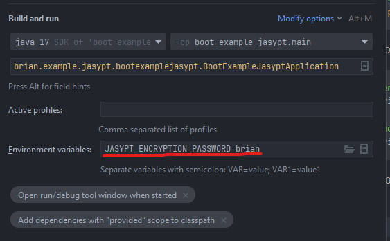

### Required config
Required following dependency
```gradle
    implementation 'com.github.ulisesbocchio:jasypt-spring-boot-starter:3.0.5'
```
(Optional) configurate Jasypt environment
```java
@Configuration
public class JasyptConfig {

    @Value("${JASYPT_ENCRYPTION_PASSWORD}")
    private String encryptionPass;

    @Bean("jasyptStringEncryptor")
    public StringEncryptor stringEncryptor(){

        PooledPBEStringEncryptor encryptor = new PooledPBEStringEncryptor();
        SimpleStringPBEConfig config = new SimpleStringPBEConfig ();

        config.setAlgorithm("PBEWithMD5AndDES");
        config.setPoolSize(1);
        config.setProviderName("SunJCE");
        config.setSaltGeneratorClassName("org.jasypt.salt.RandomSaltGenerator");
        config.setStringOutputType("base64");
        config.setPassword(encryptionPass);

        encryptor.setConfig(config);
        return encryptor;
    }

}
```

* to encrypt without maven, download jasypt binary file and run the command as following


* then add encrypted input into application.properties with surrounded by `ENC()`.
```properties
encrypted.prop=ENC(CnoQX7VxnmN9NfeczauAPCjxIhDcnQlgRzOG62i6ej0=)
none-encrypted.prop=Not encrypted property
```
* Then read properties like any other properties with @Value annotation
```java
    @Value("${encrypted.prop}")
    private String encryptedProp;

    @Value("${none-encrypted.prop}")
    private String noneEncryptedProp;
```
Jasypt configuration will automatically decrypt the text within `ENC()` and return the decrypted text

* To secure the encryption password, I pass the encryption password as environment variable, so if you want to run the code
you should pass `JASYPT_ENCRYPTION_PASSWORD` as environment variable


* When you run the code, you will see the System.out log
```
Encrypted Prop(decrypted by system):Encrypted Property
None-Encrypted Prop:Not encrypted property
```